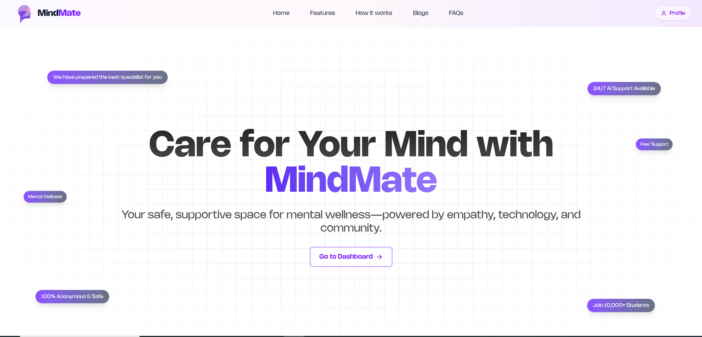
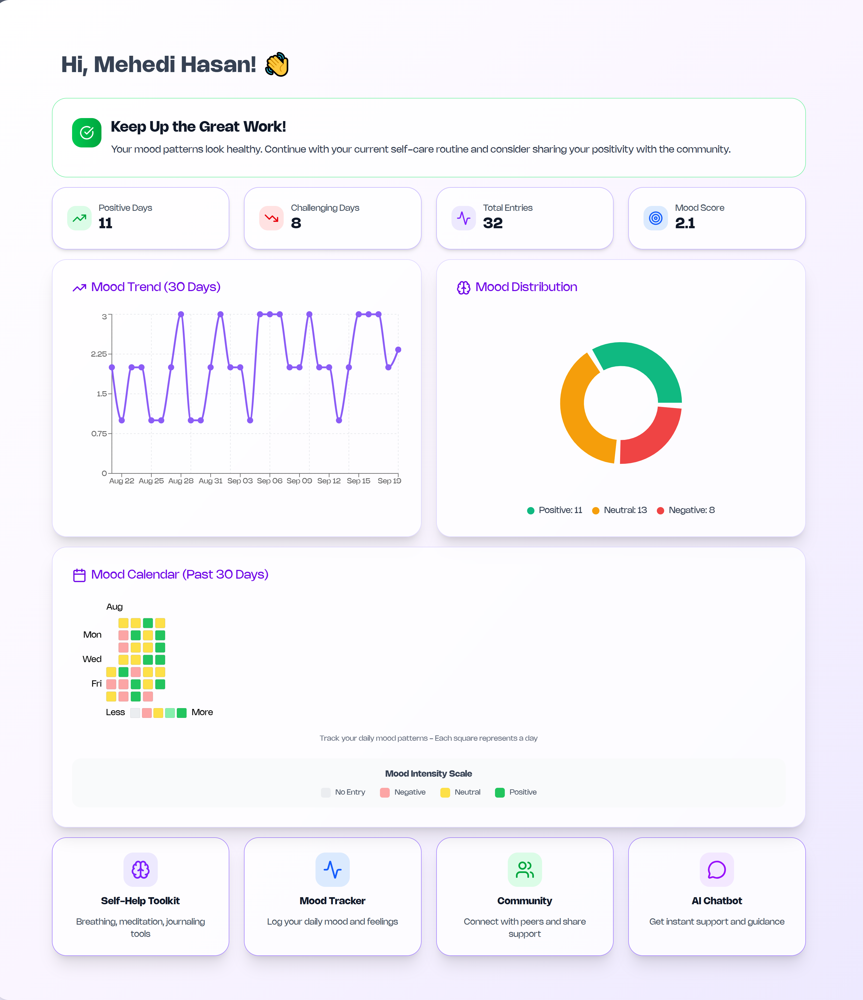
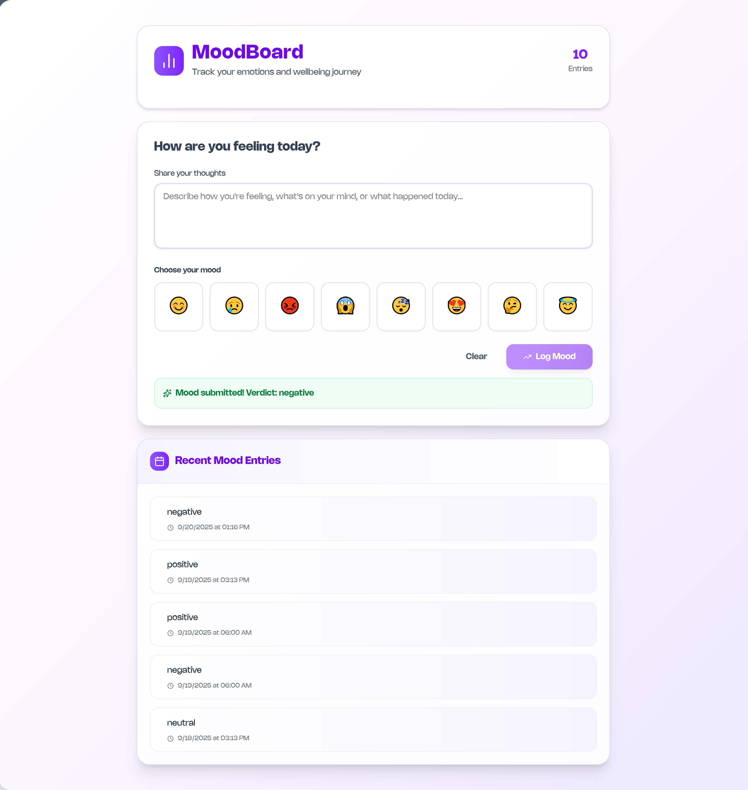
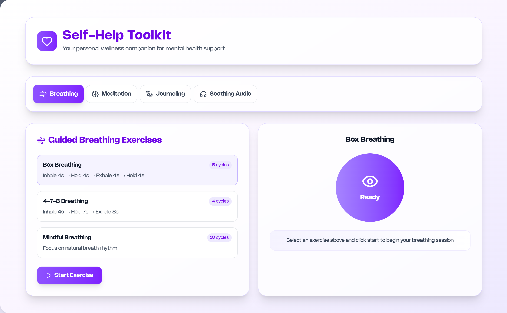
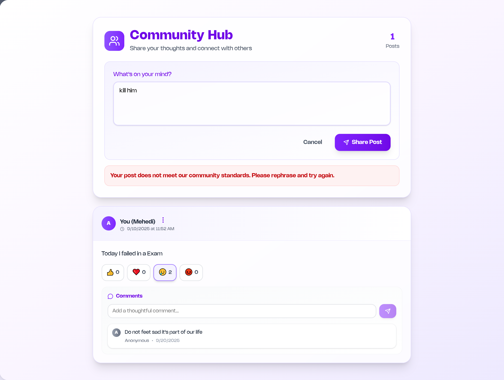
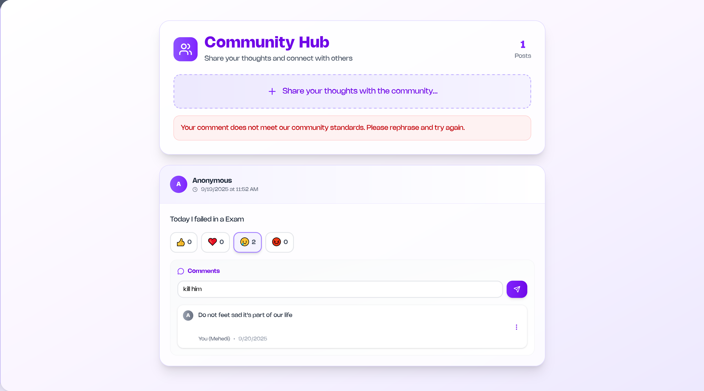
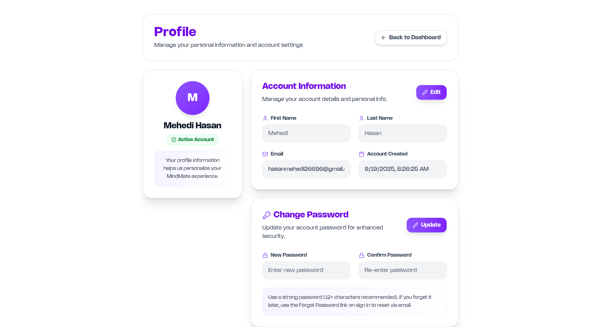

# 🧠 MindMate — Modern Mental Health Companion

<div align="center">
	
	<br />
	<b>A comprehensive mental health platform for mood tracking, community support, and AI-powered wellness recommendations.</b>
</div>

[](https://nextjs.org/)
[](https://fastapi.tiangolo.com/)
[](https://www.typescriptlang.org/)
[](https://supabase.com/)
[](https://www.postgresql.org/)
[](https://huggingface.co/)

---


## 🚀 Live Demo

- **Frontend (Next.js)**: [MindMate Frontend](https://mind-mate-sepia.vercel.app/)  
- **Backend API (FastAPI)**: [MindMate API](https://mindmate-xzqc.onrender.com)

---

## 📸 Features & Screenshots

<div align="center">
<table>
	<tr>
		<td align="center" colspan="3" style="padding: 24px 0; vertical-align: top;">
			<br />
			<b>Landing Page</b><br />
			<div style="margin-top: 8px;"></div>
		</td>
	</tr>
	<tr>
		<td align="center" colspan="3" style="padding: 24px 0; vertical-align: top;">
			<br />
			<b>Dashboard</b><br />
			<div style="margin-top: 8px;">Recommendations, heatmap, mood tracking graph</div>
		</td>
	</tr>
	<tr>
		<td align="center" colspan="3" style="padding: 24px 0; vertical-align: top;">
			<br />
			<b>Mood Tracking</b><br />
			<div style="margin-top: 8px;">Log daily moods, view trends, heatmaps, and stats</div>
		</td>
	</tr>
	<tr>
		<td align="center" colspan="3" style="padding: 24px 0; vertical-align: top;">
			<br />
			<b>AI Chatbot</b><br />
			<div style="margin-top: 8px;">Context-aware, text & voice, Markdown rendering</div>
		</td>
	</tr>
	<tr>
		<td align="center" colspan="3" style="padding: 24px 0; vertical-align: top;">
			<br />
			<b>Self-Help Toolkit</b><br />
			<div style="margin-top: 8px;">Breathing, meditation, journaling</div>
		</td>
	</tr>
	<tr>
		<td align="center" colspan="3" style="padding: 24px 0; vertical-align: top;">
			<br />
			<b>Community Posts</b><br />
			<div style="margin-top: 8px;">Share, comment, react - all content safety-checked</div>
		</td>
	</tr>
	<tr>
		<td align="center" colspan="3" style="padding: 24px 0; vertical-align: top;">
			<br />
			<b>Comments & Moderation</b><br />
			<div style="margin-top: 8px;">Safety checks before posting, error feedback</div>
		</td>
	</tr>
	<tr>
		<td align="center" colspan="3" style="padding: 24px 0; vertical-align: top;">
			<br />
			<b>User Profile</b><br />
			<div style="margin-top: 8px;">Manage profile, sign out securely</div>
		</td>
	</tr>
</table>
</div>

---

## ✨ Key Features

### 🎯 Core Functionality
- **Smart Mood Tracking** — Visual analytics with weekly/monthly trends and interactive heatmaps
- **AI-Powered Chatbot** — Context-aware conversations with text & voice support
- **Safe Community Hub** — Moderated posts, comments, and reactions with real-time safety checks
- **Wellness Toolkit** — Guided breathing exercises, meditation sessions, and journaling prompts

### 🔒 Security & Safety
- **Content Moderation** — AI-powered toxicity detection before posting
- **Secure Authentication** — Supabase-powered user management
- **Privacy First** — Anonymous posting options and data protection

### 💡 Smart Features
- **Personalized Dashboard** — AI recommendations based on mood patterns
- **Voice Integration** — Speech-to-text messaging with audio playback
- **Real-time Analytics** — Interactive charts and mood visualization
- **Mobile-Optimized** — Responsive design for all devices

---

## 🧱 Technology Stack

<div align="center">
<table>
	<tr>
		<th align="center">🎨 Frontend</th>
		<th align="center">⚙️ Backend</th>
		<th align="center">🗄️ Database</th>
		<th align="center">🤖 AI/ML</th>
	</tr>
	<tr>
		<td align="center">
			<strong>Next.js 15</strong><br/>
			React 18<br/>
			TypeScript<br/>
			Tailwind CSS<br/>
			Recharts
		</td>
		<td align="center">
			<strong>FastAPI</strong><br/>
			Python 3.11+<br/>
			SQLModel<br/>
			Alembic<br/>
			Uvicorn
		</td>
		<td align="center">
			<strong>PostgreSQL 15</strong><br/>
			Supabase<br/>
			Redis Cache<br/>
			Real-time sync
		</td>
		<td align="center">
			<strong>Google Gemini</strong><br/>
			Hugging Face<br/>
			OpenAI Whisper<br/>
			Content Moderation
		</td>
	</tr>
</table>
</div>

---

## ⚡ Getting Started

### Prerequisites

- Python 3.11+
- Node.js 18+
- PostgreSQL 15+
- Git

### Setup

```bash
git clone https://github.com/yourusername/MindMate.git
cd MindMate
```

#### Backend (.env)
```env
SUPABASE_URL="https://<your-supabase-project>.supabase.co"
SUPABASE_KEY="<your-supabase-key>"
HF_API_KEY=<your-huggingface-key>
GEMINI_API_KEY=<your-gemini-key>
```

#### Frontend (.env)
```env
NEXT_PUBLIC_SUPABASE_URL=https://<your-supabase-project>.supabase.co
NEXT_PUBLIC_SUPABASE_KEY=<your-supabase-key>
NEXT_PUBLIC_BACKEND_URL=http://localhost:8000
```

#### Backend Setup
```bash
cd backend
python -m venv env
env\Scripts\activate  # Windows
pip install -r requirements.txt
uvicorn app.main:app --reload --host 0.0.0.0 --port 8000
```

#### Frontend Setup
```bash
cd frontend
npm install
npm run dev
```

---

## 📁 Project Structure

```text
MindMate/
├── frontend/         # Next.js Frontend
│   ├── app/          # App Router Pages
│   ├── components/   # Reusable Components
│   ├── lib/          # API Service Layer
│   └── public/       # Static Assets
├── backend/          # FastAPI Backend
│   ├── app/          # Source Code
│   │   ├── api/      # API Endpoints
│   │   ├── models/   # Database Models
│   │   ├── services/ # Business Logic
│   │   └── core/     # Config & Utilities
│   ├── alembic/      # DB Migrations
│   └── requirements.txt
├── ScreenShot/       # Screenshots
└── README.md
```

---

## 🔗 API Endpoints

<div align="center">
<table>
	<tr>
		<th align="center">🌐 Endpoint</th>
		<th align="center">📝 Method</th>
		<th align="center">📋 Description</th>
		<th align="center">🔒 Features</th>
	</tr>
	<tr>
		<td><code>/peer</code></td>
		<td><strong>POST</strong></td>
		<td>Submit anonymous community post</td>
		<td>AI moderation, toxicity detection</td>
	</tr>
	<tr>
		<td><code>/mood</code></td>
		<td><strong>POST</strong></td>
		<td>Log daily mood entry</td>
		<td>Emoji, text, slider input methods</td>
	</tr>
	<tr>
		<td><code>/mood/history</code></td>
		<td><strong>GET</strong></td>
		<td>Retrieve mood analytics</td>
		<td>Weekly/monthly trends, heatmaps</td>
	</tr>
	<tr>
		<td><code>/comment</code></td>
		<td><strong>POST</strong></td>
		<td>Add moderated comment</td>
		<td>Real-time safety checks</td>
	</tr>
	<tr>
		<td><code>/chat</code></td>
		<td><strong>POST</strong></td>
		<td>Send AI chatbot message</td>
		<td>Context-aware, Gemini-powered</td>
	</tr>
	<tr>
		<td><code>/chat/voice</code></td>
		<td><strong>POST</strong></td>
		<td>Voice message transcription</td>
		<td>Speech-to-text, AI response</td>
	</tr>
</table>
</div>

### 🛡️ Security Features
- **Content Moderation**: All posts and comments filtered through AI toxicity detection
- **Rate Limiting**: API endpoint protection against abuse
- **Authentication**: Secure user sessions via Supabase
- **Data Validation**: Input sanitization and validation on all endpoints

---

## 🤖 AI Models & APIs

<div align="center">
<table>
	<tr>
		<th align="center">🎯 Category</th>
		<th align="center">🤖 Model/API</th>
		<th align="center">📝 Purpose</th>
		<th align="center">🔗 Link</th>
	</tr>
	<tr>
		<td rowspan="1"><strong>Primary AI</strong></td>
		<td>Google Gemini API</td>
		<td>Main conversational AI for intelligent responses</td>
		<td><a href="https://ai.google.dev/">🔗 Gemini</a></td>
	</tr>
	<tr>
		<td rowspan="4"><strong>Content Moderation</strong></td>
		<td>unitary/toxic-bert</td>
		<td>Toxicity detection</td>
		<td><a href="https://huggingface.co/unitary/toxic-bert">🔗 HF</a></td>
	</tr>
	<tr>
		<td>Hate-speech-CNERG/bert-base-uncased-hate-speech</td>
		<td>Hate speech classification</td>
		<td><a href="https://huggingface.co/Hate-speech-CNERG/bert-base-uncased-hate-speech">🔗 HF</a></td>
	</tr>
	<tr>
		<td>Hate-speech-CNERG/dehatebert-mono-english</td>
		<td>Advanced hate speech detection</td>
		<td><a href="https://huggingface.co/Hate-speech-CNERG/dehatebert-mono-english">🔗 HF</a></td>
	</tr>
	<tr>
		<td>cointegrated/rubert-toxic-pikabu</td>
		<td>Multilingual toxicity detection</td>
		<td><a href="https://huggingface.co/cointegrated/rubert-toxic-pikabu">🔗 HF</a></td>
	</tr>
	<tr>
		<td rowspan="3"><strong>Sentiment Analysis</strong></td>
		<td>distilroberta-base</td>
		<td>General sentiment classification</td>
		<td><a href="https://huggingface.co/distilroberta-base">🔗 HF</a></td>
	</tr>
	<tr>
		<td>cardiffnlp/twitter-roberta-base-sentiment</td>
		<td>Social media sentiment analysis</td>
		<td><a href="https://huggingface.co/cardiffnlp/twitter-roberta-base-sentiment-latest">🔗 HF</a></td>
	</tr>
	<tr>
		<td>finiteautomata/bertweet-base-sentiment-analysis</td>
		<td>Tweet sentiment classification</td>
		<td><a href="https://huggingface.co/finiteautomata/bertweet-base-sentiment-analysis">🔗 HF</a></td>
	</tr>
	<tr>
		<td rowspan="3"><strong>Fallback Chatbots</strong></td>
		<td>tiiuae/falcon-7b-instruct</td>
		<td>Instruction-following conversations</td>
		<td><a href="https://huggingface.co/tiiuae/falcon-7b-instruct">🔗 HF</a></td>
	</tr>
	<tr>
		<td>facebook/blenderbot-3B</td>
		<td>Open-domain conversations</td>
		<td><a href="https://huggingface.co/facebook/blenderbot-3B">🔗 HF</a></td>
	</tr>
	<tr>
		<td>gpt2</td>
		<td>General text generation</td>
		<td><a href="https://huggingface.co/gpt2">🔗 HF</a></td>
	</tr>
	<tr>
		<td rowspan="1"><strong>Voice Processing</strong></td>
		<td>openai/whisper-large-v3-turbo</td>
		<td>Speech-to-text transcription</td>
		<td><a href="https://huggingface.co/openai/whisper-large-v3-turbo">🔗 HF</a></td>
	</tr>
</table>
</div>

### 🛡️ AI Safety Pipeline
- **Multi-layer Moderation**: Content passes through multiple toxicity detection models
- **Real-time Processing**: Instant safety checks before posting
- **Adaptive Learning**: Models continuously improve based on community feedback
- **Fallback Systems**: Multiple AI models ensure service reliability

---

## 👥 Team

<div align="center">
<table>
	<tr>
		<td align="center">
			
			<br /><b>H.M. Mehedi Hasan</b><br />Backend Developer
		</td>
		<td align="center">
			
			<br /><b>Abu Bakar Siddique</b><br />Frontend Developer
		</td>
		<td align="center">
			
			<br /><b>Shafahid</b><br />Database Developer
		</td>
	</tr>
</table>
</div>

---

## 🌟 Show Your Support

<div align="center">
If you find MindMate helpful, please consider:
<br />
⭐ <b>Star</b> the repository | 🍴 <b>Fork</b> the project | 📢 <b>Share</b> with others | 🤝 <b>Contribute</b> code
<br /><br />
<b>Built with ❤️ for mental health and wellbeing</b>
<br />
<i>Making mental health support simple, safe, and beautiful</i>
</div>

---
